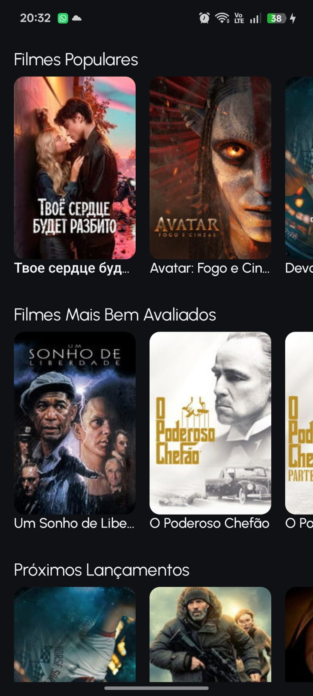

### We are under construction.

# Move 🎬

App Kotlin Multiplatform (Android + iOS) para listagem de filmes, consumindo a API do [The Movie DB (TMDB)](https://www.themoviedb.org/).

---

## ⚙️ Configuração inicial

### 1. Criar conta no TMDB

1. Acesse **[https://www.themoviedb.org/signup](https://www.themoviedb.org/signup)**
2. Preencha nome, e-mail e senha → clique em **Junte-se ao TMDB**
3. Confirme o e-mail recebido na sua caixa de entrada

---

### 2. Gerar o Access Token

1. Faça login em **[https://www.themoviedb.org/login](https://www.themoviedb.org/login)**
2. Clique no seu avatar (canto superior direito) → **Configurações**
3. No menu lateral esquerdo, clique em **API**
4. Na seção **Solicitar chave de API** em click here
5. Na página com a descrição **Is the intended use of our API for personal use?** clique em **This is for my own personal use only**
6. Vai abrir um popup fique no checkbox e clique em **Yes,this is for personal use**
7. Preencha o formulário, clique no checkbox para dizer que aceita os termos de usos. Depois só clicar em **Subscribe**.
8. Após isso, você vai para tela de **Subscription Details**, clique em **Access your API key details here.**
5. Na seção **Token de Leitura da API**, copie o token completo

> ⚠️ Use o **Token de Leitura da API**, e não a Chave da API.

---

### 3. Colar o token no projeto

Abra o arquivo:
- composeApp/src/commonMain/kotlin/com/example/move/data/network/Secrets.kt
---
Substitua `"cole_seu_token_aqui"` pelo seu token copiado:

```kotlin

object Secrets {
    const val TMDB_ACCESS_TOKEN = "cole_seu_token_aqui"
}

```

## 🖼️ Exibição do projeto

<p align="center">
  
</p>